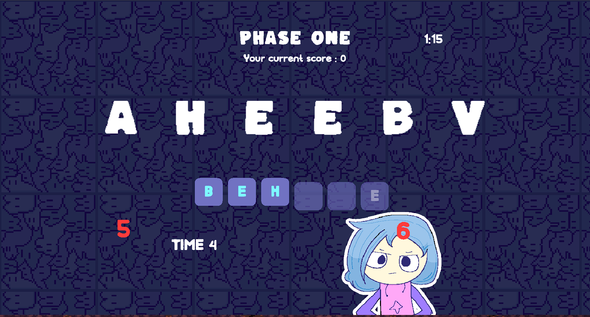
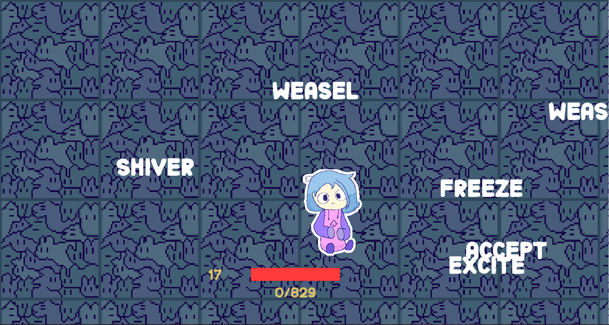

<div align="center">

# ⌨️ TYPEME

**Typing • Reaction • Score Defense**

A stylized typing game with reactive mechanics and a high-pressure clicker finale!

[About](#about) • [Features](#key-features) • [Media](#screenshots--footage) • [Run Locally](#how-to-run-locally)

</div>

---

## About

**TypeMe** is a fast-paced typing game that blends traditional word input with reactive challenges and score-driven consequences.

Across multiple phases, players must type accurately under time pressure, respond to sudden threats, and ultimately defend their score in a final clicker-based showdown where past typos return as enemies.

---

## Key Features

- **Three-Phase Gameplay Structure**  
  Two typing phases followed by a final clicker defense phase.  
  Each phase directly affects the next.

- **Dual Typing Modes**  
  - Phase 1: Normal typing (left to right)  
  - Phase 2: Reverse typing (right to left)

- **Bomb Typers**  
  Floating red numbers appear mid-typing.  
  Press the matching number key quickly to defuse them without interrupting your typing flow.

- **Bonus Clickers & Risk Choices**  
  Correct streaks may spawn optional bonus clickers for extra score.  
  Prioritize typing or chase points, your call.

- **Mistake-Driven Difficulty**  
  All typo words are collected and transformed into explosive threats during Phase 3.  
  More mistakes mean higher damage per explosion.

---

## Screenshots & Footage

### Gameplay Footage

<div align="center">
<br><br>
<br><br>  
</div>

---

## How to Run Locally

> **Note:**  
> To run the game locally, enter the `game` folder.  
> To modify or regenerate word datasets, use the Python automation inside `automate_wordlist`.

### 1. Clone the repository

```bash
git clone https://github.com/nabeellagi/TypeMe.git
cd TypeMe
````

### 2. Install dependencies

```bash
cd game
npm install
```

### 3. Run the development server

```bash
npm run dev
```

### 4. Open the game

Open your browser and navigate to the local address shown in the terminal.

---

## Word Dataset Automation

To customize or regenerate word lists:

1. Navigate to the automation folder:

   ```bash
   cd automate_wordlist
   ```

2. Run the Python script:

   ```bash
   python main.py
   ```
---

Made with ❤️ and keyboard rage
by **Nabeel Adriansyah**

